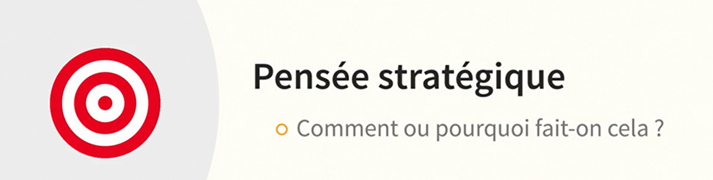

# La Pensée Critique 

Le rythme du changement et la quantité d’informations à notre disposition au quotidien compliquent notre réflexion au moment de prendre une décision. Malgré tout, on se fie souvent aux biais et aux approximations, ce qui nous piège et nous amène à tirer des conclusions erronées. Les équipes affichant la plus belle réussite utilisent la pensée critique, une analyse objective et rationnelle, pour éclairer les conclusions les plus sages. Ce cours prépare les dirigeants à affiner l’esprit critique de toute leur organisation. Découvrez comment renforcer votre esprit critique afin d’éviter les sophismes, d’identifier les biais cognitifs trompeurs, de créer de meilleurs arguments et d’affiner votre jugement et votre prise de décision. La formatrice Becki Saltzman enseigne des compétences qui amélioreront la façon dont votre société ou votre équipe innovent, relèvent les défis et répondent au changement.

## Comprendre La Pensée Critique Et La Pensée Stratégique
### La Pensée Critique

### La Pensée Créative

### La pensée Strategique

## Découvrir Les Sept éléments De la Reflexions
QPI: La question la plus importante

## Aborder Les Conditions D'une Réflexion Approfondie

## Explorer Le Fonctionnement De La Pensée

## Utiliser La Méthode REF: L'Arbitre De L'Intution
### Intution

### REF

## Utiliser Le Raisonnement ContreFactuel

## Surmonter Les Dangers De L'Aversion A La Perte

## Comprendre Les Sophismes Les Plus Courants Au Travail

## Eviter Les Erreurs De Planification

## Mieux Reformuler Ses Questions

## Découvrir Les Questions Qui Entretiennent La Curiosité

